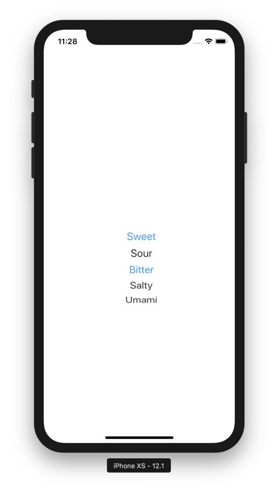

[](https://travis-ci.org/aselivanov/UIMultiPicker)
[](https://cocoapods.org/pods/UIMultiPicker)
[](https://cocoapods.org/pods/UIMultiPicker)
[](https://cocoapods.org/pods/UIMultiPicker)

`UIMultiPicker` is `UIPickerView` extension to support multiple selection.
The goal was to implement UI control mobile Safari uses to handle input for `<select multiple>` tag.

UIMultiPicker subclasses `UIControl` and sends `.valueChanged` action when any value is picked or unpicked (i.e. selection is changed).

## Example

To run the example project, clone the repo, and run `pod install` from the Example directory first.

## Installation

UIMultiPicker is available through [CocoaPods](https://cocoapods.org). To install
it, simply add the following line to your Podfile:

```ruby
pod 'UIMultiPicker'
```
